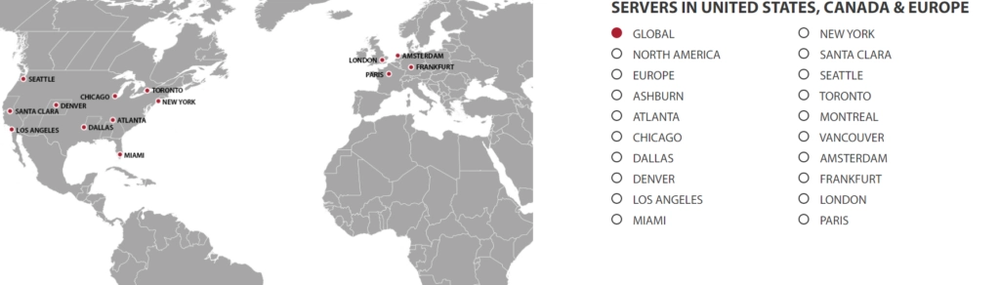

# 全球化业务的最优解：GTHost让你的服务触达世界每个角落

你有没有遇到过这样的困境：客户遍布全球,但服务器离他们太远,网站加载慢得让人抓狂?或者你正计划拓展海外市场,却担心服务质量跟不上?

这些问题其实有个简单粗暴的解决方案——**找一个全球布局足够广的主机服务商**。GTHost就是这样一个存在:17个数据中心遍布世界各地,你想在哪开服务器就在哪开,想要多大配置就要多大配置。听起来很美好对吧?让我们深入聊聊这家公司到底怎么样。

---

## GTHost是谁?

GTHost的全称是GLOBALTELELEHOST Corp,2012年成立,目标很明确——**让全球各地的用户都能用上性能好、价格合理的主机服务**。

这家公司最大的卖点就是数据中心多。17个机房分布在全球各个角落,你可以根据自己的客户群体选择最合适的位置。而且他们家的服务器配置不是固定套餐那种,你可以按需定制——需要多少存储空间、要什么样的性能,自己说了算。

👉 [想要覆盖全球用户?看看GTHost如何帮你实现](https://cp.gthost.com/en/join/72c7e6b2fc118929f9ede2978f008806)

## 数据中心分布情况

GTHost的17个数据中心具体位置包括:

这个布局基本覆盖了主要市场区域。不管你的目标用户在北美、欧洲还是亚太,都能找到离他们近的节点。距离越近,访问速度越快,这是物理规律,谁也改不了。

## 安全性怎么样?

做生意的都知道,数据就是命根子。你辛辛苦苦积累的业务数据、客户信息,要是丢了或者被攻击了,那损失可不是一点半点。

GTHost在安全方面做了这些事:

**DDoS防护**是标配。现在网络攻击太常见了,尤其是做得有点起色的网站,总有人眼红。GTHost会帮你挡住这些攻击,而且他们也不允许你用他们的服务器去攻击别人——这点挺重要的,说明平台管理规范。

**SSL加密**也是全覆盖。你的数据在传输过程中都是加密的,别人截获了也看不懂。这对电商网站、会员系统这类涉及敏感信息的业务尤其重要。

## 客户支持靠不靠谱?

换个新的主机服务商,刚开始肯定会遇到各种问题——不熟悉控制面板、不知道怎么配置、出了点小故障不知道怎么处理。这时候客服的响应速度和专业程度就很关键了。

GTHost的客服是**24/7全天候在线**的。你可以通过电话、在线聊天或邮件联系他们。不管是半夜出问题还是周末需要帮助,都能找到人。这点对需要保证业务连续性的企业来说,还是挺重要的。

## 核心功能亮点

### 不限流量

很多主机商给你限定每月流量,超了就要加钱或者直接给你限速。这种感觉就像手机套餐用超了一样难受——明明业务在增长,却因为流量问题被卡住。

GTHost直接给你**无限流量**。网站访问量突然暴增?没关系,不会有额外费用,也不会被限速。对于业务处在快速增长期的公司来说,这个设定太友好了。

### 快速部署

下单后等好几天才能用上服务器?那种感觉就像网购明明付了钱,却迟迟不发货一样让人抓狂。

GTHost的部署速度是**5到15分钟**。从你完成支付到服务器可以使用,基本就是泡杯咖啡的时间。这个速度在行业里算是相当快的了,特别适合那些等不及的急性子用户。

### 完整的Root权限

有些主机商出于管理考虑,会限制你对服务器的控制权限。但对于有技术能力、想要精细化管理服务器的用户来说,这种限制就很憋屈。

GTHost给你**完整的Root访问权限**。服务器是你的,你想怎么配置就怎么配置,想装什么软件就装什么软件,完全自主。当然,这也意味着你需要对服务器的安全和稳定负责。

## 提供哪些主机类型?

GTHost的产品线覆盖了从共享主机到独立服务器的各个层级。不管你是个人博客、中小企业网站还是大型应用,都能找到合适的方案。

## 值得选择GTHost的独立服务器吗?

如果你需要独立服务器,GTHost确实是个不错的选择。

原因很简单:**选择多、灵活性高**。17个数据中心任你挑,配置可以按需定制。不像有些服务商只提供几个固定套餐,要么配置不够用,要么性能过剩浪费钱。

👉 [立即定制你的专属服务器方案](https://cp.gthost.com/en/join/72c7e6b2fc118929f9ede2978f008806)

而且独立服务器的性能和稳定性是共享主机没法比的。如果你的业务已经发展到一定规模,或者对性能有较高要求,独立服务器是必然的选择。

## 常见问题解答

**GTHost有免费试用吗?**

不是完全免费,但他们提供低价试用期,价格从1美元到10美元不等。具体政策建议去看他们的服务条款,因为不同的产品试用政策可能不一样。

**GTHost提供什么样的技术支持?**

技术支持覆盖账户问题和技术问题两大类。你可以通过在线聊天、电话或邮件联系他们,而且针对不同类型的问题,他们有专门的支持邮箱。这种分类处理的方式效率会更高一些。

---

## 总结一下

GTHost最大的优势就是**全球化布局和灵活定制**。17个数据中心让你的服务能够真正触达全球用户,而且访问速度有保障。无限流量、快速部署、完整权限这些特性,对于需要稳定可靠服务的企业来说都很实用。

安全防护方面也做得到位,DDoS防护和SSL加密都是标配。24/7的客服支持让你遇到问题能及时解决。

唯一需要注意的是试用政策可能不太直观,建议在购买前仔细了解清楚条款。

总的来说,如果你的业务需要全球化部署,或者对服务器的位置和配置有特殊要求,GTHost是个值得考虑的选择。它能帮你解决"客户在全球、服务器太远"这个核心痛点,让你的业务真正实现全球覆盖。
